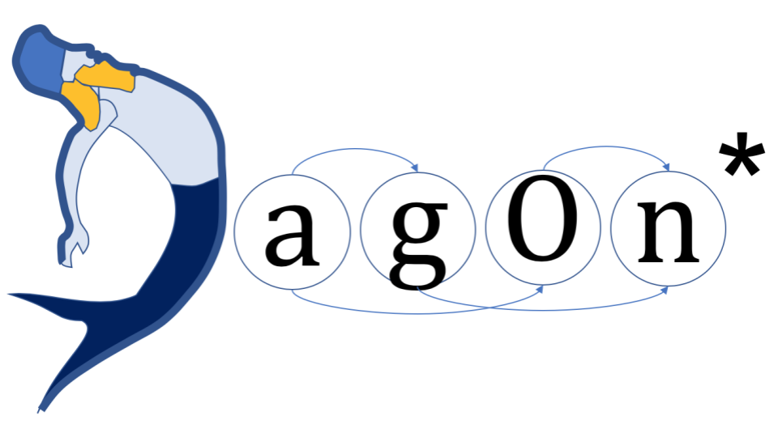

# DAGonStar

DAGonStar, also written as DAGon\*, is a lightweight Python workflow engine for
running directed acyclic graph (DAG) workflows across local machines, remote
servers, HPC clusters, containers, and cloud infrastructure.



DAGonStar workflows are ordinary Python programs. Tasks can depend explicitly on
other tasks, or implicitly through `workflow://` data references that DAGonStar
resolves into task dependencies and staging operations.

DAGonStar is used as the primary workflow engine to run real-world production-level
applications.

DAGonStar is in production at the [Center for Monitoring and Modeling Marine and Atmosphere](https:/meteo.uniparthenope.it)
applications hosted at the University of Naples "Parthenope".

# Motivation
Thanks to the advent of public, private, and hybrid clouds, the democratization of
Computational resources changed the rules in many scientific fields.
For decades, one of the efforts of computer scientists and computer engineers was the
development of tools able to simplify access to high-end computational resources by
computational scientists. However, nowadays, any science field can be considered
"computational" if the availability of powerful but easy-to-manage workflow
engines is crucial.

# Acknowledgments
The following initiatives support DAGonStar development:

* Research agreement "Modelling mytilus farming at scale"
  (MytilX, CUP D13C24000470002, funded by the Istituto Zooprofilattico Sperimentale dell’Umbria e delle Marche) -
  DAGonStar orchestrates the production workflow to deliver use cases, study zones specific to weather, marine, pollutants,
  and farmed mussels contamination forecasts and predictions.


* Research contract "Mytilus farming System with High-Performance Computing and Artificial Intelligence"
  (MytilEx, CUP I63C23000180002, funded by the Campania Region, Veterinary sector) -
  DAGonStar orchestrates the production workflow to deliver daily 168 weather, marine, pollutants,
  and farmed mussels contamination forecasts and predictions. [PWA](http://meteo.uniparthenope.it/mytilex/)


* EuroHPC H2020 project "Adaptative Multi-tier Intelligent data manager for Exascale"
  (ADMIRE, 956748-ADMIRE-H2020-JTI-EuroHPC-2019-1, funded by the European Commission) - 
  WP7: DAGonStar orchestrates the Environmental Application, delivering on-demand weather, marine,
  and pollutants simulations and forecasts on the Campania Region (Italy).
  [link](https://www.admire-eurohpc.eu)

# Cite DAGonStar

## Workflow engine

* Sánchez-Gallegos, Dante Domizzi, Diana Di Luccio, Sokol Kosta, J. L. Gonzalez-Compean, and Raffaele Montella.
  "An efficient pattern-based approach for workflow supporting large-scale science: The DagOnStar experience."
  Future Generation Computer Systems 122 (2021): 187-203.
  [link](https://www.sciencedirect.com/science/article/pii/S0167739X21000984)


* Barron-Lugo, J.A., Gonzalez-Compean, J. L., Carretero, J., Lopez-Arevalo, I., & Montella, R. (2021).
  A novel transversal processing model to build environmental big data services in the cloud. 
  Environmental Modelling & Software, 144, 105173.
  [link](https://www.sciencedirect.com/science/article/abs/pii/S1364815221002152)


* Sánchez-Gallegos, Dante D., Diana Di Luccio, José Luis Gonzalez-Compean, and Raffaele Montella.
  "Internet of things orchestration using dagon workflow engine."
  In 2019 IEEE 5th world forum on internet of things (WF-IoT), pp. 95-100. IEEE, 2019.
  [link](https://ieeexplore.ieee.org/abstract/document/8767199)


* Sánchez-Gallegos, Dante D., Diana Di Luccio, J. L. Gonzalez-Compean, and Raffaele Montella.
  "A microservice-based building block approach for scientific workflow engines: Processing large data volumes with dagonstar."
  In 2019 15th International Conference on Signal-Image Technology & Internet-Based Systems (SITIS), pp. 368-375. IEEE, 2019.
  [link](https://ieeexplore.ieee.org/abstract/document/9067951)


* Montella, Raffaele, Diana Di Luccio, and Sokol Kosta.
  "Dagon: Executing direct acyclic graphs as parallel jobs on anything."
  In 2018 IEEE/ACM Workflows in Support of Large-Scale Science (WORKS), pp. 64-73. IEEE, 2018.
  [link](https://ieeexplore.ieee.org/abstract/document/8638376)

## Applications
* Mellone, Gennaro, Ciro Giuseppe De Vita, Enrico Zambianchi, David Expósito Singh,
  Diana Di Luccio, and Raffaele Montella.
  "Democratizing the computational environmental marine data science: using the high-performance cloud-native computing for inert transport and diffusion lagrangian modelling."
  In 2022 IEEE International Workshop on Metrology for the Sea; Learning to Measure Sea Health Parameters (MetroSea), pp. 267-272. IEEE, 2022.
  [link](https://ieeexplore.ieee.org/abstract/document/9950862)


* De Vita, Ciro Giuseppe, Gennaro Mellone, Aniello Florio,
  Catherine Alessandra Torres Charles, Diana Di Luccio,
  Marco Lapegna, Guido Benassai, Giorgio Budillon, and Raffaele Montella.
  "Parallel and hierarchically-distributed Shoreline Alert Model (SAM)." 
  In 2023 31st Euromicro International Conference on Parallel, Distributed and Network-Based Processing (PDP), pp. 109-113. IEEE, 2023.
  [link](https://ieeexplore.ieee.org/abstract/document/10136945)


* Montella, Raffaele, Diana Di Luccio, Ciro Giuseppe De Vita, Gennaro Mellone,
  Marco Lapegna, Gloria Ortega, Livia Marcellino, Enrico Zambianchi, and Giulio Giunta.
  "A highly scalable high-performance Lagrangian transport and diffusion model for marine pollutants assessment."
  In 2023 31st Euromicro International Conference on Parallel, Distributed and Network-Based Processing (PDP), pp. 17-26. IEEE, 2023.
  [link](https://ieeexplore.ieee.org/abstract/document/10137219)


## Surveys

* Aldinucci, Marco, Giovanni Agosta, Antonio Andreini, Claudio A. Ardagna,
  Andrea Bartolini, Alessandro Cilardo, Biagio Cosenza et al.
  "The Italian research on HPC key technologies across EuroHPC."
  In Proceedings of the 18th ACM international conference on computing frontiers, pp. 178-184. 2021.
  [link](https://dl.acm.org/doi/abs/10.1145/3457388.3458508)

## License

DAGonStar is distributed under the Apache License 2.0. See `LICENSE`.
## Documentation

The full documentation set is available in `docs/`:

- [Introduction to Scientific Workflows](docs/introduction_to_scientific_workflow.md)
- [Getting Started](docs/getting_started.md)
- [Configuration](docs/configuration.md)
- [Architecture](docs/architecture.md)
- [User Guide](docs/user_guide.md)
- [Reference Guide](docs/reference_guide.md)
- [Developer Guide](docs/developer_guide.md)
- [Running External Scientific Software](docs/running_external_software.md)
- [The `workflow://` Schema](docs/the_workflow_schema.md)
- [Checkpoints](docs/checkpoints.md)
- [Asynchronous workflow launch](docs/asynch_launch.md)
- [Examples Catalog](docs/examples/README.md)
- [Tutorials: twelve incremental lessons](docs/tutorial/README.md)

## What DAGonStar supports

- Python-defined workflows.
- Explicit task graphs and data-driven dependency discovery.
- Local batch tasks.
- Remote SSH tasks.
- Slurm tasks.
- Docker tasks, locally or over SSH.
- Cloud-backed tasks through Apache Libcloud providers.
- OpenAI-compatible LLM tasks with JSON prompts and `workflow://` text inputs.
- Data staging by link, copy, SCP, Globus, and SKYCDS.
- Checkpoint/resume support.
- Meta-workflows that coordinate multiple workflows.

## Project status and quality assessment

DAGonStar is a research-oriented workflow engine with a useful, documented
core, rather than a fully polished modern library. Its strongest areas are the
compact Python workflow model, explicit and `workflow://`-derived dependencies,
checkpointing, and a broad set of execution and staging integrations.
Workflows can also run in a background thread with lifecycle callbacks for
local progress reporting.

The repository has a sound baseline for changes to the core behavior:

- 39 unit tests cover configuration parsing, workflow defaults, and dependency
  discovery, cycle validation, JSON serialization, checkpoint reuse, staging
  command generation, packaging extras, optional integration boundaries, and
  selected shell-quoting behavior;
- GitHub Actions runs that suite and source compilation on Python 3.8 and
  Python 3.12, plus focused Ruff and mypy checks on Python 3.12;
- package extras keep Docker, cloud, Globus, and API dependencies out of the
  base installation;
- documentation covers configuration, architecture, checkpoints, examples,
  and the incremental tutorial; and
- sample configuration avoids committed credentials and the SKYCDS path checks
  for required runtime configuration; and
- the LLM task boundary has local tests and a fully local mock-provider example.

The test suite is intentionally fast and local: it validates command generation,
failure propagation, and integration boundaries, not live Docker, SSH, Slurm,
cloud, Globus, or SKYCDS services. CI also runs focused style checks and a
progressive type check over the shell-command helper. Several legacy and
site-specific code paths still construct shell commands, so changes around
external execution should be kept small, quoted defensively, and verified at
the boundary being changed.

## Installation

Use Python 3.8 or newer.

```bash
git clone https://github.com/DagOnStar/dagonstar.git
cd dagonstar
python3 -m venv .venv
. .venv/bin/activate
python -m pip install --upgrade pip
python -m pip install -r requirements.txt
```

For editable development installs:

```bash
python -m pip install -e .
```

Optional integrations are available as install extras:

```bash
python -m pip install -e ".[docker]"
python -m pip install -e ".[cloud]"
python -m pip install -e ".[globus]"
python -m pip install -e ".[api]"
python -m pip install -e ".[all]"
```

The base package does not install Docker, cloud, Globus, or Flask service
libraries. If an integration is requested without its extra, DAGonStar reports
the corresponding install command at the integration boundary.

`requirements.txt` remains a full development/demo environment that installs
the optional integration dependencies together.

## Configuration

Copy the sample configuration before running examples:

```bash
cp dagon.ini.sample dagon.ini
```

Important sections:

- `[batch]`: local scratch directory and staging thread settings.
- `[dagon_service]`: optional DAGon service registration.
- `[slurm]`: default Slurm partition for Slurm staging or tasks.
- `[ec2]`, `[digitalocean]`, `[gce]`: optional cloud credentials.
- `[llm.<name>]`: optional OpenAI-compatible LLM provider configuration.

Never commit real cloud keys, Globus tokens, SKYCDS tokens, SSH private keys, or
site-specific passwords. SKYCDS values are read from these environment variables:

```bash
export DAGON_SKYCDS_CLIENT_TOKEN=...
export DAGON_SKYCDS_CATALOG_TOKEN=...
export DAGON_SKYCDS_API_TOKEN=...
export DAGON_SKYCDS_IP=...
```

## Quick start

This example creates a four-task local workflow. Task `D` consumes outputs from
tasks `B` and `C`; the `workflow://` references are used to infer dependencies
and stage files.

```python
from dagon import Workflow
from dagon.task import DagonTask, TaskType


if __name__ == "__main__":
    workflow = Workflow("DataFlow-Demo")

    task_a = DagonTask(TaskType.BATCH, "A", "mkdir -p output; hostname > output/f1.txt")
    task_b = DagonTask(TaskType.BATCH, "B", "echo $RANDOM > f2.txt; cat workflow:///A/output/f1.txt >> f2.txt")
    task_c = DagonTask(TaskType.BATCH, "C", "echo $RANDOM > f2.txt; cat workflow:///A/output/f1.txt >> f2.txt")
    task_d = DagonTask(TaskType.BATCH, "D", "cat workflow:///B/f2.txt >> f3.txt; cat workflow:///C/f2.txt >> f3.txt")

    for task in (task_a, task_b, task_c, task_d):
        workflow.add_task(task)

    workflow.make_dependencies()
    workflow.run()
```

## Running examples

Most examples expect a `dagon.ini` file in the current working directory or in
the example directory.

```bash
cp dagon.ini.sample examples/dagon.ini
cd examples/taskflow
python taskflow-demo.py
```

Example groups:

- `examples/taskflow`: explicit task dependencies.
- `examples/dataflow/batch`: local data-driven workflows and checkpointing.
- `examples/dataflow/slurm`: Slurm and remote Slurm workflows.
- `examples/dataflow/docker`: Docker-backed workflows.
- `examples/dataflow/cloud`: cloud-backed task examples.
- `examples/transversal`: meta-workflow and transversal processing examples.
- `examples/hipes-tutorial`: tutorial material for HiPES workflows.
- `examples/envapp`: environmental application workflows and utilities.

## Development

Useful checks:

```bash
python -m unittest discover -s tests -v
python -m py_compile dagon/*.py dagon/api/*.py dagon/communication/*.py dagon/ftp_publisher/*.py dagon/peer2peer/*.py
python -m ruff check dagon/shell.py tests
python -m mypy dagon/shell.py
python -m pip install -e .
```

The repository includes a lightweight unit test suite under `tests/`. The tests
focus on behavior that should remain stable while features evolve: configuration
loading, workflow defaults, dependency discovery, cycle validation, JSON
serialization, and runtime-secret validation.

GitHub Actions runs the unit tests and source compilation checks on pushes to
`master`/`main` and on pull requests.

When changing workflow execution behavior, add a targeted unit test where
possible. If the behavior depends on Docker, Slurm, SSH, Globus, or a cloud
provider, add the smallest safe test for local logic and record any manual
integration command used in your change notes.

Recommended maintenance priorities:

1. Add tests for checkpoint/resume behavior and staging command generation.
2. Add integration tests for local batch workflows and mocked tests for
   external-service integrations.
3. Replace shell string concatenation with safer quoting helpers where practical.
4. Split optional integrations into extras such as `dagonstar[docker]`,
   `dagonstar[cloud]`, `dagonstar[globus]`, and `dagonstar[api]`.
5. Add type hints to public workflow, task, configuration, and staging APIs.

## Troubleshooting

### Missing `dagon.ini`

Create one from the sample:

```bash
cp dagon.ini.sample dagon.ini
```

### Docker examples cannot connect to Docker

Check that Docker is running and that your user can access the Docker socket:

```bash
docker info
```

### Remote tasks fail over SSH

Verify key-based SSH manually first:

```bash
ssh -i /path/to/key user@host hostname
```

### Globus or SKYCDS staging fails

Confirm the integration-specific credentials and endpoint IDs are configured.
SKYCDS values must be supplied through environment variables, not committed in
source files.


