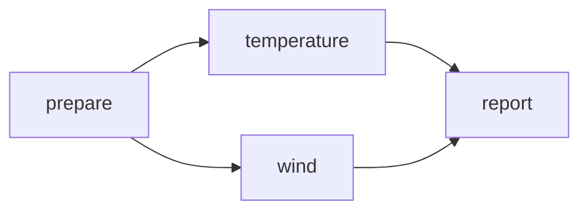

# Lesson 02: Build a Directed Acyclic Graph

> **Track:** Core
> **Runtime:** Local
> **Colab:** Supported
> **Estimated effort:** approximately 25 minutes

## Learning outcomes

After completing this lesson, you will be able to:

- construct fan-out and fan-in dependencies and explain topological execution;
- explain the underlying mechanism;
- verify observed behavior and state what the evidence does not prove.

## Prerequisites

- [Lesson 01](lesson_01_create_and_run_the_first_local_task.md), or equivalent concepts.
- [Lesson 00](lesson_00_set_up_dagonstar_and_understand_the_learning_model.md) setup.
- No external service unless stated below.

## Scientific scenario

Observation preparation feeds independent temperature and wind analyses, which then feed one report. This exposes parallelism without confusing order with movement.

## Conceptual model

A dependency edge constrains order. consumer.add_dependency_to(producer) means the producer finishes first; it does not name or stage a file.

Text form: prepare -> {temperature, wind} -> report.

New terms are collected in the [glossary](resources/glossary.md).

## Build the workflow

Read the authoritative example or structural check before running it. The canonical lifecycle is add_task(), optional explicit make_dependencies() and Validate_WF() for inspection, then run(). run() constructs dependencies automatically when needed.

## Run the example

From the repository root:

~~~bash
python examples/tutorial/lesson_02_build_a_dag.py
~~~

## Expected result

The script prints predecessor names and creates a report after both analyses.

## Verify

~~~bash
python examples/tutorial/lesson_02_build_a_dag.py
~~~

Assertions prove graph structure and completion, not simultaneous execution.

## What DAGonStar did

DAGonStar constructed or inspected the graph, applied the selected staging and execution policy, and exposed evidence through task state, working directories, or exports. Files and exit status are observed evidence; broader portability and scientific validity require the controls stated here.

## Controlled experiment

Remove the wind-to-report edge, predict the predecessor set, and explain why success no longer guarantees report ordering.

## Common problems and diagnosis

Print each task's prevs after make_dependencies() to diagnose unexpected edges. See [troubleshooting](resources/troubleshooting.md).

## Scientific practice

Control dependencies should represent real causal constraints; unnecessary edges hide parallelism.

## Summary

A DAG expresses valid order, while artifacts require a data-dependency mechanism.

## Next lesson

Next, connect producer outputs with workflow references. Return to the [syllabus](README.md) at any time.
