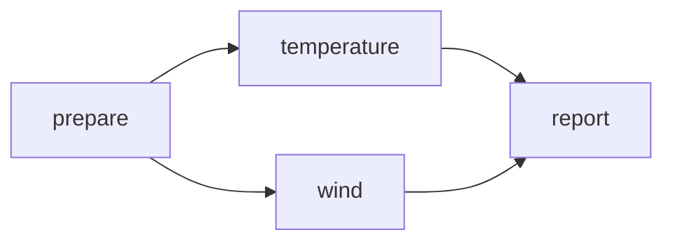

# Lesson 02: Build a Directed Acyclic Graph

> **Track:** Core
> **Runtime:** Local
> **Colab:** Supported
> **Estimated effort:** approximately 25 minutes

## Learning outcomes

After completing this lesson, you will be able to:

- construct fan-out and fan-in dependencies and explain topological execution;
- relate each observed result to the workflow mechanism that produced it;
- verify observed behavior and state what the evidence does not prove.

## Prerequisites

- [Lesson 01](lesson_01_create_and_run_the_first_local_task.md), or equivalent concepts.
- No external service unless stated below.

## Scientific scenario

Observation preparation feeds independent temperature and wind analyses, which then feed one report. This exposes parallelism without confusing order with movement.

## Conceptual model

A dependency edge constrains order. consumer.add_dependency_to(producer) means the producer finishes first; it does not name or stage a file.

Text form: prepare -> {temperature, wind} -> report.

New terms are collected in the [glossary](resources/glossary.md).

## Build the workflow

Read the example as a graph before reading its commands: acquisition precedes two independent analyses, and both analyses precede the report. Translate each `consumer.add_dependency_to(producer)` call into an arrow and verify that no arrow returns to an earlier node.

## Run the example

From the repository root:

~~~bash
python examples/tutorial/lesson_02_build_a_dag.py
~~~

## Expected result

The script prints predecessor names and creates a report after both analyses.

## Verify

~~~bash
python examples/tutorial/lesson_02_build_a_dag.py
~~~

Assertions prove graph structure and completion, not simultaneous execution.

## What DAGonStar did

DAGonStar stored explicit predecessor and successor relations and selected a valid execution order. It enforced completion order; it did not infer which files the report consumes.

## Controlled experiment

Remove the wind-to-report edge, predict the predecessor set, and explain why success no longer guarantees report ordering.

## Common problems and diagnosis

Print each task's prevs after make_dependencies() to diagnose unexpected edges. See [troubleshooting](resources/troubleshooting.md).

## Scientific practice

Control dependencies should represent real causal constraints; unnecessary edges hide parallelism.

## Summary

A DAG expresses valid order, while artifacts require a data-dependency mechanism.

## Next lesson

Next, connect producer outputs with workflow references. Return to the [syllabus](README.md) at any time.
