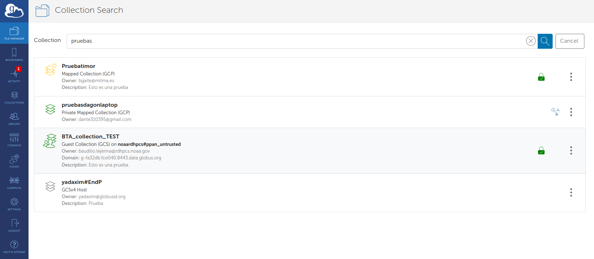
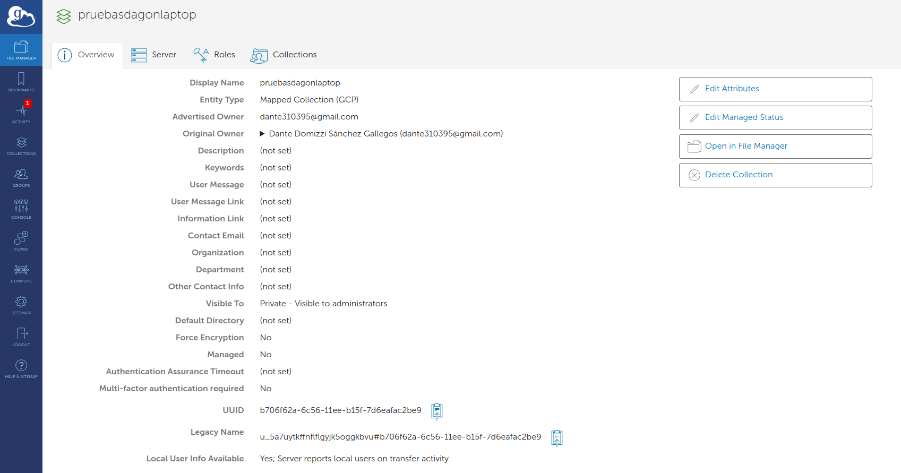
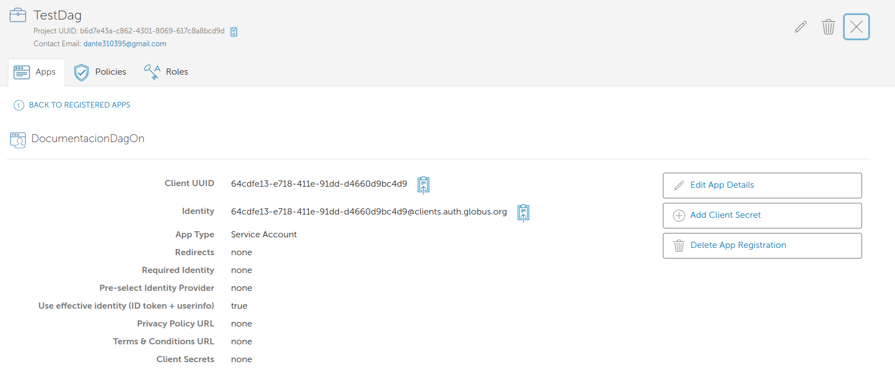
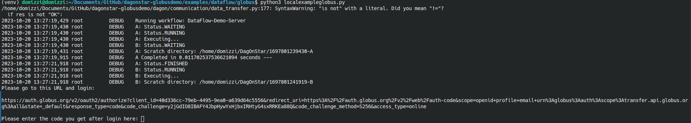
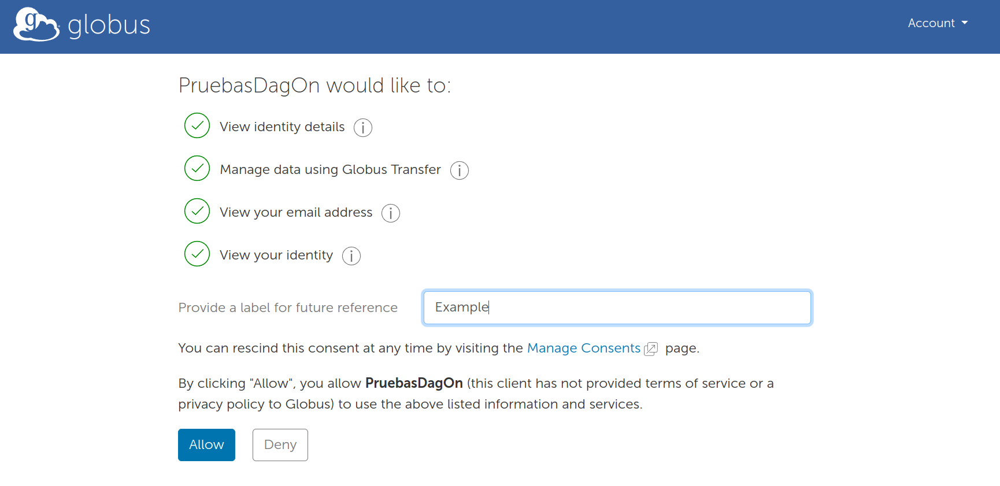
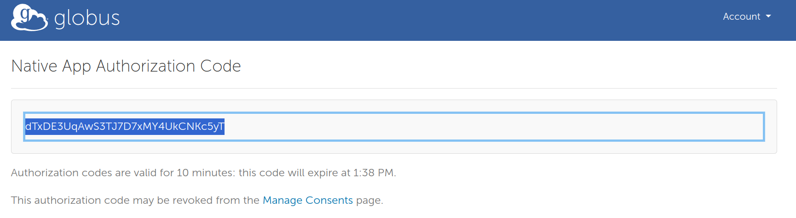
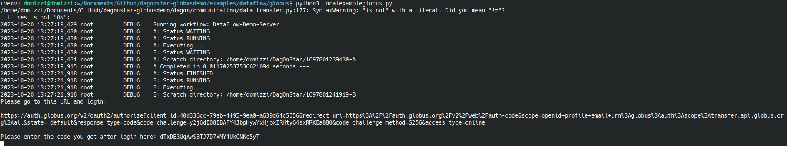
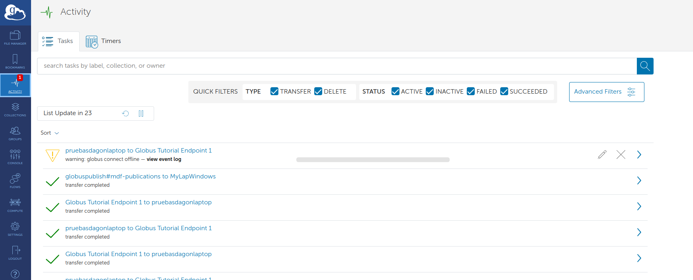
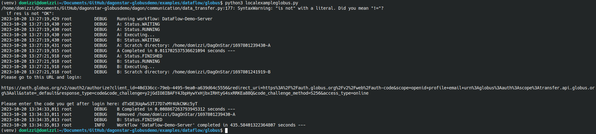

# DAGonStar and Globus Transfer


## Requirements


This infrastructure-dependent example studies staged transfer through Globus.
In addition to DAGonStar, it requires:


* [Globus Connect Personal](https://www.globus.org/globus-connect-personal) or [Globus Connect Server](https://www.globus.org/globus-connect-server)


## Preconfigurations


To run this example, at least three UUID endpoints are required.


1. Source endpoint: The first one is the UUID of the endpoint where the data is produced.
2. Intermediate endpoint: an endpoint accessible through the Internet, such as a site-approved Globus Connect Server collection.
3. Sink endpoint: the collection to which the consumer has access.


The first and third endpoints can be configured using Globus Connect Personal.


To get the UUID of an endpoint, first go to [https://app.globus.org/](https://app.globus.org/) and log in. Then navigate to File Manager. In ```Collection```, just write the name of your endpoint/collection and click on the three dots on the right.





A new page with an overview of the endpoint is open. From this page, you can copy the UUID.





Repeat these steps to get the UUID of the three endpoints.


Moreover, it is required to have a Globus Client ID. To get it, please follow the next steps:


1. Go to [https://developers.globus.org/](https://developers.globus.org/) and click on ```Manage and Register Applications```.
2. Log in or Sign In the Goblus Authenticator.
3. Click on ```Register a service account or application credential for automation```.
4. Choose or create a new project.
5. Enter the name of the App, and click on ```Register App```.
6. Copy the client UUID and store it in a local, ignored configuration file.





Open the file ```dagon.ini``` and in the globus section paste your client ID and the UUID of the intermediate endpoint, as follows:


```conf
[globus]
clientid=<your-globus-client-id>
intermadiate_endpoint=<your-intermediate-collection-id>
```


In this file, also replace the ```scratch_dir_base``` with any directory in your home partition. For example, ```/home/USER/DagOnStar```.

Now, open the file ```dataflow-demo-globus.py```, and replace the ```globusendpoint``` variable of ```taskA``` and ```taskB```.


## Execution of the demo


Open the root directory of DagOnStar in a terminal, and run the following commands to prepare it.


```bash
virtualenv venv
. venv/bin/activate
pip install -r requirements.txt
export PYTHONPATH=$PWD:$PYTHONPATH
```


Now navigate to the directory of the demo.


```bash
cd examples/dataflow/globus
```

Execute the file ```dataflow-demo-globus.py``` as follows:

```bash 
python dataflow-demo-globus.py
```


During execution, follow the interactive Globus authorization flow and keep all
tokens out of source files, notebooks, screenshots, and captured teaching
artifacts. If you use Globus Connect Personal, start it on the relevant host.














Now, the workflow is in execution and the results of the first stage are uploaded to Globus and downloaded by the second stage. You can monitor the transference of data by log in the [Globus File Manager](https://app.globus.org/activity).





Wait until the execution of the workflow is completed.





You can see the results of the execution on the scratch directory.


